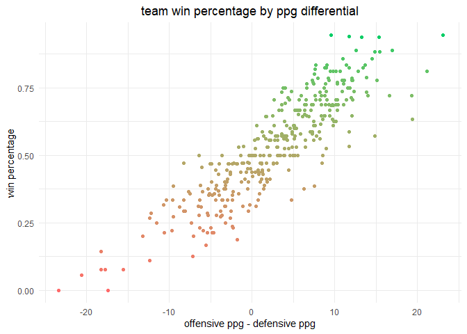
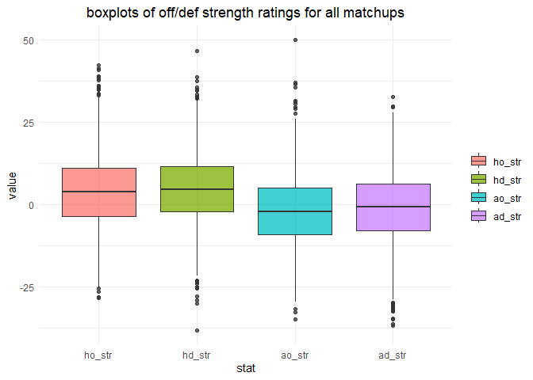

hoopR
================
chad allison
2023-01-16

### setup

``` r
tictoc::tic() # start script runtime tracker
library(tidyverse)
library(hoopR)
theme_set(theme_minimal())
```

### data import

``` r
# write_csv(load_mbb_pbp(seasons = 2023), "pbp_data.csv")
df = read_csv("pbp_data.csv", col_types = cols())
glimpse(df)
```

    ## Rows: 1,111,934
    ## Columns: 55
    ## $ id                              <dbl> 4.014829e+17, 4.014829e+17, 4.014829e+~
    ## $ sequence_number                 <dbl> 101806601, 101806602, 101806603, 10180~
    ## $ type_id                         <dbl> 519, 540, 540, 558, 587, 572, 519, 598~
    ## $ type_text                       <chr> "PersonalFoul", "MadeFreeThrow", "Made~
    ## $ text                            <chr> "Foul on Caleb Love.", "Shykeim Philli~
    ## $ away_score                      <dbl> 0, 1, 2, 2, 2, 4, 4, 4, 4, 4, 4, 4, 4,~
    ## $ home_score                      <dbl> 0, 0, 0, 0, 0, 0, 0, 0, 0, 0, 0, 1, 2,~
    ## $ period_number                   <dbl> 1, 1, 1, 1, 1, 1, 1, 1, 1, 1, 1, 1, 1,~
    ## $ period_display_value            <chr> "1st Half", "1st Half", "1st Half", "1~
    ## $ clock_display_value             <time> 19:33:00, 19:33:00, 19:33:00, 19:14:0~
    ## $ scoring_play                    <lgl> FALSE, TRUE, TRUE, FALSE, FALSE, TRUE,~
    ## $ score_value                     <dbl> 0, 1, 1, 2, 0, 2, 0, 0, 2, 0, 0, 1, 1,~
    ## $ team_id                         <dbl> 153, 350, 350, 153, 350, 350, 153, 153~
    ## $ participants_0_athlete_id       <dbl> 4433144, 4592975, 4592975, 4395650, 45~
    ## $ wallclock                       <dttm> 2022-11-08 02:07:19, 2022-11-08 02:07~
    ## $ shooting_play                   <lgl> FALSE, TRUE, TRUE, TRUE, FALSE, TRUE, ~
    ## $ participants_1_athlete_id       <dbl> NA, NA, NA, NA, NA, NA, NA, NA, NA, NA~
    ## $ season                          <dbl> 2023, 2023, 2023, 2023, 2023, 2023, 20~
    ## $ season_type                     <dbl> 2, 2, 2, 2, 2, 2, 2, 2, 2, 2, 2, 2, 2,~
    ## $ away_team_id                    <dbl> 350, 350, 350, 350, 350, 350, 350, 350~
    ## $ away_team_name                  <chr> "UNC Wilmington", "UNC Wilmington", "U~
    ## $ away_team_mascot                <chr> "Seahawks", "Seahawks", "Seahawks", "S~
    ## $ away_team_abbrev                <chr> "UNCW", "UNCW", "UNCW", "UNCW", "UNCW"~
    ## $ away_team_name_alt              <chr> "UNC Wilmington", "UNC Wilmington", "U~
    ## $ home_team_id                    <dbl> 153, 153, 153, 153, 153, 153, 153, 153~
    ## $ home_team_name                  <chr> "North Carolina", "North Carolina", "N~
    ## $ home_team_mascot                <chr> "Tar Heels", "Tar Heels", "Tar Heels",~
    ## $ home_team_abbrev                <chr> "UNC", "UNC", "UNC", "UNC", "UNC", "UN~
    ## $ home_team_name_alt              <chr> "North Carolina", "North Carolina", "N~
    ## $ home_team_spread                <dbl> 23.5, 23.5, 23.5, 23.5, 23.5, 23.5, 23~
    ## $ game_spread                     <dbl> -23.5, -23.5, -23.5, -23.5, -23.5, -23~
    ## $ home_favorite                   <lgl> TRUE, TRUE, TRUE, TRUE, TRUE, TRUE, TR~
    ## $ game_spread_available           <lgl> TRUE, TRUE, TRUE, TRUE, TRUE, TRUE, TR~
    ## $ game_id                         <dbl> 401482947, 401482947, 401482947, 40148~
    ## $ qtr                             <dbl> 1, 1, 1, 1, 1, 1, 1, 1, 1, 1, 1, 1, 1,~
    ## $ time                            <time> 19:33:00, 19:33:00, 19:33:00, 19:14:0~
    ## $ clock_minutes                   <dbl> 19, 19, 19, 19, 19, 18, 18, 18, 18, 18~
    ## $ clock_seconds                   <chr> "33", "33", "33", "14", "11", "51", "3~
    ## $ half                            <dbl> 1, 1, 1, 1, 1, 1, 1, 1, 1, 1, 1, 1, 1,~
    ## $ game_half                       <dbl> 1, 1, 1, 1, 1, 1, 1, 1, 1, 1, 1, 1, 1,~
    ## $ lag_qtr                         <dbl> NA, 1, 1, 1, 1, 1, 1, 1, 1, 1, 1, 1, 1~
    ## $ lead_qtr                        <dbl> 1, 1, 1, 1, 1, 1, 1, 1, 1, 1, 1, 1, 1,~
    ## $ lag_game_half                   <dbl> NA, 1, 1, 1, 1, 1, 1, 1, 1, 1, 1, 1, 1~
    ## $ lead_game_half                  <dbl> 1, 1, 1, 1, 1, 1, 1, 1, 1, 1, 1, 1, 1,~
    ## $ start_quarter_seconds_remaining <dbl> 1173, 1173, 1173, 1154, 1151, 1131, 11~
    ## $ start_half_seconds_remaining    <dbl> 1773, 1773, 1773, 1754, 1751, 1731, 17~
    ## $ start_game_seconds_remaining    <dbl> 2973, 2973, 2973, 2954, 2951, 2931, 29~
    ## $ game_play_number                <dbl> 1, 2, 3, 4, 5, 6, 7, 8, 9, 10, 11, 12,~
    ## $ end_quarter_seconds_remaining   <dbl> 600, 1173, 1173, 1173, 1154, 1151, 113~
    ## $ end_half_seconds_remaining      <dbl> 1200, 1773, 1773, 1773, 1754, 1751, 17~
    ## $ end_game_seconds_remaining      <dbl> 2400, 2973, 2973, 2973, 2954, 2951, 29~
    ## $ period                          <dbl> 1, 1, 1, 1, 1, 1, 1, 1, 1, 1, 1, 1, 1,~
    ## $ coordinate_x                    <dbl> NA, NA, NA, NA, NA, NA, NA, NA, NA, NA~
    ## $ coordinate_y                    <dbl> NA, NA, NA, NA, NA, NA, NA, NA, NA, NA~
    ## $ media_id                        <lgl> NA, NA, NA, NA, NA, NA, NA, NA, NA, NA~

### getting end game data

``` r
end_game = df |>
  filter(type_text == "End Game") |>
  select(home_team_name, away_team_name, home_score, away_score) |>
  mutate(win_team = ifelse(home_score > away_score, home_team_name, away_team_name),
         lose_team = ifelse(win_team == home_team_name, away_team_name, home_team_name)) |>
  rename(home_team = home_team_name, away_team = away_team_name)

sample_n(end_game, 10)
```

    ## # A tibble: 10 x 6
    ##    home_team          away_team            home_score away_score win_t~1 lose_~2
    ##    <chr>              <chr>                     <dbl>      <dbl> <chr>   <chr>  
    ##  1 West Virginia      Pennsylvania                 92         58 West V~ Pennsy~
    ##  2 Stephen F. Austin  New Mexico State             69         60 Stephe~ New Me~
    ##  3 San Diego State    UC Irvine                    72         69 San Di~ UC Irv~
    ##  4 Charlotte          Boise State                  54         42 Charlo~ Boise ~
    ##  5 Northern Iowa      Evansville                   72         55 Northe~ Evansv~
    ##  6 South Florida      Wichita State                66         70 Wichit~ South ~
    ##  7 Nebraska           Omaha                        75         61 Nebras~ Omaha  
    ##  8 Boise State        Cal State Northridge         55         46 Boise ~ Cal St~
    ##  9 Oregon             Arizona                      87         68 Oregon  Arizona
    ## 10 Eastern Washington North Dakota State           78         70 Easter~ North ~
    ## # ... with abbreviated variable names 1: win_team, 2: lose_team

### getting team records

*note that only teams having played ten or more games are included*

``` r
all_teams = sort(unique(c(end_game$home_team, end_game$away_team)))
team_records = data.frame(team = all_teams)

team_wins = end_game |>
  count(win_team) |>
  rename(team = win_team)

team_losses = end_game |>
  count(lose_team) |>
  rename(team = lose_team)

team_records = team_records |>
  left_join(team_wins, by = "team") |>
  rename(wins = n) |>
  left_join(team_losses, by = "team") |>
  rename(losses = n) |>
  mutate(wins = ifelse(is.na(wins), 0, wins),
         losses = ifelse(is.na(losses), 0, losses),
         games_played = wins + losses,
         win_prop = round(wins / games_played, 3)) |>
  filter(games_played >= 10)

all_teams = team_records$team
all_teams = all_teams[!all_teams %in% c("Alcorn State", "South Carolina State")]
rm(team_wins, team_losses)

team_records |>
  arrange(desc(win_prop)) |>
  head(10)
```

    ##                team wins losses games_played win_prop
    ## 1        Charleston   17      1           18    0.944
    ## 2           Houston   17      1           18    0.944
    ## 3            Kansas   16      1           17    0.941
    ## 4  Florida Atlantic   15      1           16    0.938
    ## 5            Purdue   15      1           16    0.938
    ## 6        New Mexico   16      2           18    0.889
    ## 7              UCLA   16      2           18    0.889
    ## 8           Alabama   15      2           17    0.882
    ## 9             Texas   15      2           17    0.882
    ## 10     Kansas State   12      2           14    0.857

### getting team offensive points per game stats

``` r
team_off_ppg = data.frame(team = all_teams, off_ppg = NA)

get_off_ppg = function(team) {
  
  home_total = end_game |>
    filter(home_team == team) |>
    pull(home_score) |>
    sum()
  
  away_total = end_game |>
    filter(away_team == team) |>
    pull(away_score) |>
    sum()
  
  team_total = home_total + away_total
  team_gp = team_records$games_played[which(team_records$team == team)]
  team_ppg = round(team_total / team_gp, 3)
  return(team_ppg)
  
}

team_off_ppg = team_off_ppg |>
  mutate(off_ppg = sapply(team, get_off_ppg))

# top 10 teams, offensive ppg
team_off_ppg |>
  arrange(desc(off_ppg)) |>
  head(10)
```

    ##                team off_ppg
    ## 1           Gonzaga  86.286
    ## 2          Missouri  85.688
    ## 3               UAB  85.500
    ## 4     James Madison  85.000
    ## 5  Youngstown State  84.895
    ## 6           Arizona  84.833
    ## 7            Toledo  84.600
    ## 8     Southern Utah  84.588
    ## 9           Alabama  84.353
    ## 10           Xavier  84.167

### getting team defensive points per game stats

``` r
team_def_ppg = data.frame(team = all_teams, def_ppg = NA)

get_def_ppg = function(team) {
  
  home_total = end_game |>
    filter(home_team == team) |>
    pull(away_score) |>
    sum()
  
  away_total = end_game |>
    filter(away_team == team) |>
    pull(home_score) |>
    sum()
  
  team_total = home_total + away_total
  team_gp = team_records$games_played[which(team_records$team == team)]
  team_ppg = round(team_total / team_gp, 3)
  return(team_ppg)
  
}

team_def_ppg = team_def_ppg |>
  mutate(def_ppg = sapply(team, get_def_ppg))

# top 10 teams, defensive ppg
team_def_ppg |>
  arrange(def_ppg) |>
  head(10)
```

    ##                 team def_ppg
    ## 1            Houston  52.889
    ## 2          Tennessee  53.250
    ## 3        North Texas  54.294
    ## 4            Rutgers  56.944
    ## 5  Mississippi State  57.471
    ## 6       Saint Mary's  57.632
    ## 7         Iowa State  57.938
    ## 8        Sam Houston  58.500
    ## 9             Dayton  58.750
    ## 10           Liberty  59.000

### joining offensive and defensive points per game stats

``` r
team_ppg = team_off_ppg |>
  left_join(team_def_ppg, by = "team")

team_ppg |>
  mutate(diff = off_ppg - def_ppg) |>
  arrange(desc(diff)) |>
  left_join(team_records, by = "team") |>
  ggplot(aes(diff, win_prop)) +
  geom_point(aes(col = win_prop)) +
  scale_color_gradient(high = "springgreen3", low = "indianred1") +
  labs(x = "offensive ppg - defensive ppg",
       y = "win percentage",
       title = "team win percentage by ppg differential") +
  theme(plot.title = element_text(hjust = 0.5),
        legend.position = "none")
```

<!-- -->

### adding ppg stats to end game data and creating strength ratings

``` r
end_expanded = end_game |>
  filter(home_team %in% all_teams & away_team %in% all_teams) |>
  left_join(team_ppg, by = c("home_team" = "team")) |>
  rename(home_off_ppg = off_ppg, home_def_ppg = def_ppg) |>
  left_join(team_ppg, by = c("away_team" = "team")) |>
  rename(away_off_ppg = off_ppg, away_def_ppg = def_ppg) |>
  mutate(ho_str = home_score - away_def_ppg,
         hd_str = away_off_ppg - away_score,
         ao_str = away_score - home_def_ppg,
         ad_str = home_off_ppg - home_score)

end_expanded |>
  pivot_longer(c(ho_str, hd_str, ao_str, ad_str), names_to = "stat", values_to = "value") |>
  mutate(stat = factor(stat, levels = c("ho_str", "hd_str", "ao_str", "ad_str"))) |>
  ggplot(aes(stat, value)) +
  geom_boxplot(aes(fill = stat), alpha = 0.75) +
  labs(fill = NULL, title = "boxplots of off/def strength ratings for all matchups") +
  theme(plot.title = element_text(hjust = 0.5))
```

<!-- -->

**how to interpret this plot**: i have created these “strength” ratings
which are intended to quantify how a team is performing relative to the
opposing team’s average performance. for example, `ho_str` is the
difference between points scored by the home team and the opposing
team’s average points allowed per game. a positive value would indicate
that the home team performed well offensively, and a negative value
would indicate that the opposing team performed well defensively. of
course, it isn’t always as simple as positive value =\> offense good &
negative value =\> defense good, but that is a simple way to interpret
the stat.

i do not find it surprising that the values for `ho_str` and `hd_str`
appear to be slightly higher than those of `ao_str` and `ad_str` because
that would explain the home court advantage. as far as distributions go,
the four statistics seem to be very similar aside from their difference
in median. `hd_str` appears to have the highest median value, which
corresponds to `ao_str` having the lowest median value

### getting team overall strength ratings

``` r
get_off_str = function(team) {
  home = filter(end_expanded, home_team == team)
  away = filter(end_expanded, away_team == team)
  home_off_str = sum(home$ho_str)
  away_off_str = sum(away$ao_str)
  games_played = team_records$games_played[which(team_records$team == team)]
  off_str = round((home_off_str + away_off_str) / games_played, 3)
  return(off_str)
}

get_def_str = function(team) {
  home = filter(end_expanded, home_team == team)
  away = filter(end_expanded, away_team == team)
  home_def_str = sum(home$hd_str)
  away_def_str = sum(away$ad_str)
  games_played = team_records$games_played[which(team_records$team == team)]
  def_str = round((home_def_str + away_def_str) / games_played, 3)
  return(def_str)
}

team_str = data.frame(team = all_teams) |>
  mutate(off_str = sapply(team, get_off_str),
         def_str = sapply(team, get_def_str))

team_str |>
  mutate(category = case_when(off_str > 0 & def_str > 0 ~ "good off, good def",
                              off_str > 0 & def_str < 0 ~ "good off, bad def",
                              off_str < 0 & def_str > 0 ~ "bad off, good def",
                              off_str < 0 & def_str < 0 ~ "bad off, bad def")) |>
  ggplot(aes(off_str, def_str)) +
  geom_point(aes(col = category)) +
  geom_hline(yintercept = 0, linetype = "dashed") +
  geom_vline(xintercept = 0, linetype = "dashed") +
  scale_color_manual(values = c("indianred3", "#C696D7", "#93B6DC", "springgreen4")) +
  labs(x = "offensive strength rating",
       y = "defensive strength rating",
       col = NULL, title = "scatterplot of offensive and defensive strength ratings") +
  theme(plot.title = element_text(hjust = 0.5),
        legend.position = "bottom")
```

<!-- -->

### getting separate home and away strength ratings

``` r
home_counts = df |>
  filter(text == "End of Game",
         home_team_name %in% all_teams,
         away_team_name %in% all_teams) |>
  count(home_team_name)

away_counts = df |>
  filter(text == "End of Game",
         home_team_name %in% all_teams,
         away_team_name %in% all_teams) |>
  count(away_team_name)

home_away_counts = home_counts |>
  rename(team = home_team_name,
         home_n = n) |>
  left_join(away_counts, by = c("team" = "away_team_name")) |>
  rename(away_n = n)

rm(home_counts, away_counts)

get_home_off_str = function(team) {
  games = filter(end_expanded, home_team == team)
  if (nrow(games) == 0) return(0)
  ho_str = round(sum(games$ho_str) / home_away_counts$home_n[which(home_away_counts$team == team)], 3)
  return(ho_str)
}

get_home_def_str = function(team) {
  games = filter(end_expanded, home_team == team)
  if (nrow(games) == 0) return(0)
  hd_str = round(sum(games$hd_str) / home_away_counts$home_n[which(home_away_counts$team == team)], 3)
  return(hd_str)
}

get_away_off_str = function(team) {
  games = filter(end_expanded, away_team == team)
  if (nrow(games) == 0) return(0)
  ao_str = round(sum(games$ao_str) / home_away_counts$away_n[which(home_away_counts$team == team)], 3)
  return(ao_str)
}

get_away_def_str = function(team) {
  games = filter(end_expanded, away_team == team)
  if (nrow(games) == 0) return(0)
  ad_str = round(sum(games$ad_str) / home_away_counts$away_n[which(home_away_counts$team == team)], 3)
  return(ad_str)
}

home_away_str = data.frame(team = all_teams) |>
  mutate(home_off_str = sapply(team, get_home_off_str),
         home_def_str = sapply(team, get_home_def_str),
         away_off_str = sapply(team, get_away_off_str),
         away_def_str = sapply(team, get_away_def_str),
         home_str = home_off_str + home_def_str,
         away_str = away_off_str + away_def_str,
         home_away_diff = home_str - away_str)

home_away_str |>
  pivot_longer(c(home_str, away_str), names_to = "home_away", values_to = "value") |>
  mutate(home_away = factor(home_away, levels = c("home_str", "away_str"))) |>
  ggplot(aes(value)) +
  geom_density(aes(fill = home_away), alpha = 0.5) +
  scale_fill_manual(values = c("springgreen4", "indianred3")) +
  labs(x = "strength rating", y = "density", fill = NULL,
       title = "distribution of strength ratings for home and away games") +
  theme(plot.title = element_text(hjust = 0.5))
```

<!-- -->

### evaluating accuracy of game predictions based entirely on home and away strength ratings

``` r
res = end_game |>
  filter(home_team %in% all_teams & away_team %in% all_teams) |>
  left_join(home_away_str, by = c("home_team" = "team")) |>
  select(home_team, away_team, win_team, home_str) |>
  left_join(home_away_str, by = c("away_team" = "team")) |>
  select(home_team, away_team, win_team, home_str.x, away_str) |>
  rename(home_str = home_str.x) |>
  mutate(pred_winner = ifelse(home_str >= away_str, home_team, away_team)) |>
  count(win_team == pred_winner) |>
  pull(n)

paste0("basic accuracy: ", round(res[2] / sum(res), 3))
```

    ## [1] "basic accuracy: 0.766"

*work in progress, still in introductory stage*

### script runtime

``` r
tictoc::toc()
```

    ## 26.3 sec elapsed
